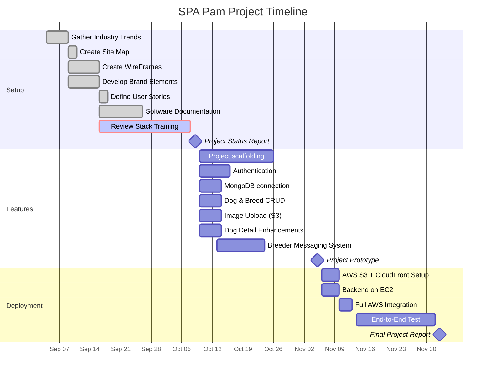

# Spa Pam Project


Example Pull Request


## Starting the Application

### Run NPM install 
change directory to client and run `npm install`

change directory to server and run `npm install`

```bash
cd server
npm install   # generates server/package-lock.json

cd ../client
npm install   # generates client/package-lock.json
```

---

## Run Docker
### install docker 
Download docker for you Operating System 

Opne docker in background

### Start Docker 
From IDE Terminal run: 

Docker Start  
> docker compose -f docker-compose.dev.yml up --build -d

Docker Shut Down  
> docker compose -f docker-compose.dev.yml down

Restart  
> docker compose -f docker-compose.dev.yml restart 


Restart Client Only   
> docker compose -f docker-compose.dev.yml restart client 

Logs  
> docker compose -f docker-compose.dev.yml logs -f server

Cypress Global Command (Setup Mac Repo - required)
> run-spa-tests  

Local SPA → http://localhost:5173  

Live -> https://d3ksowre3dfy72.cloudfront.net

### Users created using the seed script:
UserNames:   
admin@example.com  
breeder@example.com  
customer@example.com  

Password is the same:   
Password123!
