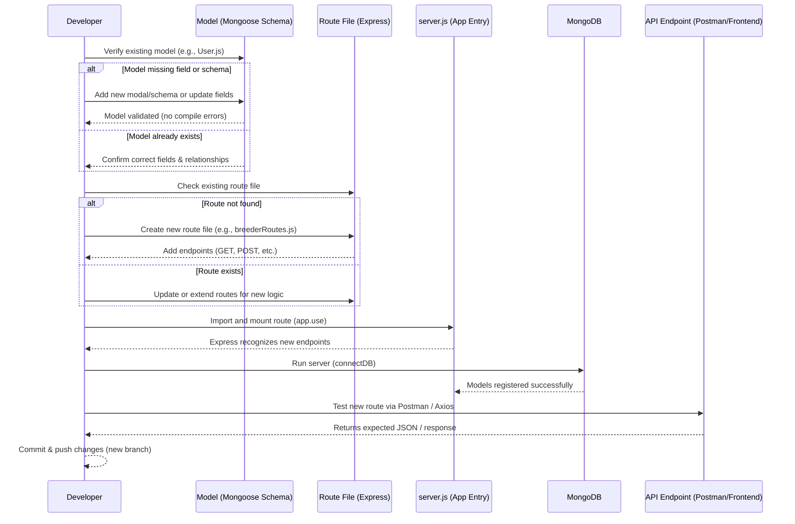

```mermaid
sequenceDiagram
    participant Dev as Developer
    participant Model as Model (Mongoose Schema)
    participant Route as Route File (Express)
    participant Server as server.js (App Entry)
    participant DB as MongoDB
    participant API as API Endpoint (Postman/Frontend)

    Dev->>Model: Verify existing model (e.g., User.js)
    alt Model missing field or schema
        Dev->>Model: Add new modal/schema or update fields
        Model-->>Dev: Model validated (no compile errors)
    else Model already exists
        Model-->>Dev: Confirm correct fields & relationships
    end

    Dev->>Route: Check existing route file
    alt Route not found
        Dev->>Route: Create new route file (e.g., breederRoutes.js)
        Route-->>Dev: Add endpoints (GET, POST, etc.)
    else Route exists
        Dev->>Route: Update or extend routes for new logic
    end

    Dev->>Server: Import and mount route (app.use)
    Server-->>Dev: Express recognizes new endpoints

    Dev->>DB: Run server (connectDB)
    DB-->>Server: Models registered successfully

    Dev->>API: Test new route via Postman / Axios
    API-->>Dev: Returns expected JSON / response

    Dev-->>Dev: Commit & push changes (new branch)
```